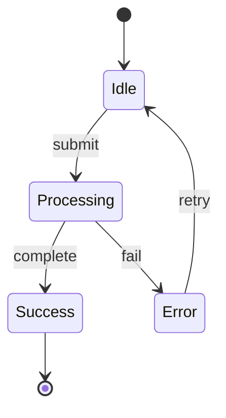

# Interactive Explanations

Build animated visualizations to understand complex algorithms and code.

**Inspired by:** Simon Willison's pattern of generating interactive explanations
with animations and step-by-step controls to truly understand how code works.

## When to Use

- Algorithm behavior is hard to reason about
- Data structure operations are confusing
- Need to understand state changes over time
- Explaining complex code to others
- Debugging algorithm edge cases visually

## Quick Reference

| Visualization Type | Best Tool |
|--------------------|-----------|
| Algorithm animation | HTML + Canvas/SVG + JS |
| State machine | Mermaid diagram |
| Data flow | ASCII art or Mermaid |
| Tree/graph traversal | Interactive HTML |
| Sorting/searching | Animated bars |

## Process

### 1. Identify What to Visualize

```text
"I want to understand how [algorithm/structure] handles [operation]"

Examples:
- "How does a red-black tree rebalance after insertion?"
- "What happens during merge sort on this array?"
- "How does the A* pathfinding algorithm explore nodes?"
```

### 2. Request Interactive Explanation

Prompt pattern:

```text
Create an interactive HTML visualization that explains [algorithm].
Include:
- Step-by-step controls (next/prev/play/pause)
- Visual state display at each step
- Annotations explaining what's happening
- Edge case demonstrations

Make it self-contained (single HTML file with inline CSS/JS).
```

### 3. Iterate on Clarity

After first version:

- "Highlight the comparison being made at each step"
- "Show the recursive call stack"
- "Add a speed control for the animation"
- "Visualize what happens with input [edge case]"

## Example: Sorting Visualization

```text
Create an interactive visualization of quicksort with:
- Array shown as colored bars
- Pivot highlighted in red
- Current comparison in yellow
- Step-by-step mode with explanation text
- Random array generator
- Edge case buttons (sorted, reverse, duplicates)
```

## Output Formats

### HTML + JavaScript (Preferred)

Self-contained, runs in browser, shareable:

```html
<!DOCTYPE html>
<html>
<head>
  <title>Algorithm Visualization</title>
  <style>/* inline styles */</style>
</head>
<body>
  <div id="canvas"></div>
  <div id="controls">
    <button onclick="step()">Step</button>
    <button onclick="play()">Play</button>
  </div>
  <script>/* visualization logic */</script>
</body>
</html>
```

### Mermaid Diagrams

For state machines and flowcharts:



### ASCII Animation

For terminal/text contexts:

```text
Step 1: [5] [3] [8] [1] [9]
        ^pivot

Step 2: [3] [1] | [5] | [8] [9]
        < pivot   ^   > pivot
```

## Storage

Save useful visualizations to Basic Memory:

```python
write_note_basic - memory(
    title="Red-Black Tree Insertion Visualization",
    content="[HTML content or link]",
    directory="knowledge/visualizations",
    tags=["visualization", "algorithm", "tree", "interactive"],
)
```

## Integration with Walkthroughs

Combine with `linear-walkthrough` skill:

1. Create walkthrough of the code
2. Generate visualization for complex parts
3. Link visualization from walkthrough

## Tools

| Tool | Use Case |
|------|----------|
| HTML Canvas | Pixel-based animations |
| SVG | Scalable graphics, DOM manipulation |
| D3.js | Complex data visualizations |
| Mermaid | Diagrams in markdown |
| ASCII | Terminal-friendly, universal |

## Examples of Good Visualizations

- Sorting:
  Bars that swap with smooth animation
- Trees:
  Nodes that highlight during traversal
- Graphs:
  Edges that light up during pathfinding
- Recursion:
  Call stack that grows/shrinks visually
- State machines:
  Current state highlighted, transitions animated

## Related Skills

- `linear-walkthrough` - Code understanding without visualization
- `deep-dive` - Thorough investigation with questioning
- `code-recipes` - Extract patterns after understanding
